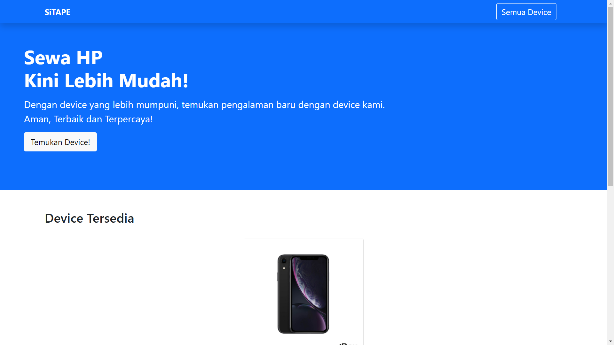

    <h1 align="center">SiTAPE</h1>
    
Sistem Informasi Rental HP

[![Contributors][contributors-shield]][contributors-url]
[![Stargazers][stars-shield]][stars-url]
[![Issues][issues-shield]][issues-url]
[![MIT License][license-shield]][license-url]

 

<!-- Table of Contents -->

    
Daftar Isi

    <ol>
        <!-- Section 1 -->
        <li>
            <a href="#tentang-project">Tentang Project</a>
            <ul>
                <li><a href="#stack-aplikasi">Stack Aplikasi</a></li>
            </ul>
        </li>
        <!-- Section 2 -->
        <li>
            <a href="#memulai-aplikasi">Memulai Aplikasi</a>
            <ul>
                <li><a href="#persyaratan-system">Persyaratan Sistem</a></li>
                <li><a href="#instalasi">Instalasi</a></li>
            </ul>
        </li>
        <li><a href="#pedoman-penggunaan">Pedoman Penggunaan</a></li>
        <li><a href="#lisensi">Lisensi</a></li>
        <li><a href="#kontributor">Kontributor</a></li>
        <li><a href="#pustaka">Pustaka</a></li>
    </ol>

<!-- ABOUT THE PROJECT  -->
## Tentang Project
Sistem Informasi Rental HP (SiTAPE) merupakan aplikasi berbasis web yang dapat membantu orang-orang yang membutuhkan Handphone dalam penggunaan jangka pendek. Aplikasi ini memudahkan pelanggan dan pebisnis dalam merentalkan Handphone. Pelanggan dapat melihat-lihat Handphone yang disediakan pebisnis, kemudian memilih Handphone yang ingin digunakan. Aplikasi akan menyediakan kontak admin untuk melakukan transaksi.

**SiTAPE** diharapkan dapat:
- memudahkan pebisnis untuk mempromosikan bisnisnya
- memudahkan pelanggan dlm mendapatkan info hp tersedia
- memudahkan pebisnis dlm mendata device yang tersedia dan transaksi

### Stack Aplikasi
Aplikasi ini dibuat menggunakan:
- [CodeIgniter 3](https://codeigniter.com/userguide3/)
- [Bootstrap 5](https://getbootstrap.com/docs/5.0/getting-started/introduction/)

## Memulai Aplikasi
### Persyaratan Sistem
Sistem yang akan digunakan untuk menjalankan aplikasi ini, membutuhkan:
- PHP versi 8
- MySQL versi 8 atau MariaDB versi 10

### Instalasi
*Akan didokumentasikan nanti.*

## Pedoman Penggunaan
- Pengguna masuk ke halaman utama web
- Pengguna masuk ke menu device
- Pengguna mengklik device (berstatus 'tersedia') yang ingin dipilih
- Pengguna mengklik tombol add
- Admin akan mendapat informasi permintaan device kemudian melakukan transaksi melalui aplikasi lain sebagai bantuan
- Device yang dipilih telah berstatus 'dipakai'
- Setelah pengguna mengembalikan device, admin mengubah status device tersebut menjadi 'tersedia'

## Lisensi
Aplikasi Sistem Informasi Rental HP (SiTAPE) dibuat untuk keperluan pemenuhan **tugas akhir** mata kuliah **Pemrograman Web** dari kelompok 5, Paralel A. Project ini dilisensikan di bawah lisensi [MIT][license-url].

## Kontributor✨
Thanks goes to these wonderful people:

<!-- ALL-CONTRIBUTORS-LIST:START -->
<table>
    <tr>
        <td align="center">
            <a href="https://github.com/danilhendrasr">
                
                 
                <b>Danil Hendra Suryawan</b>
            </a>
        </td>
        <td align="center">
            <a href="https://github.com/dewa143">
                
                 
                <b>Dewa Eka Wirasaputra</b>
            </a>
        </td>
        <td align="center">
            <a href="https://github.com/thisham">
                
                 
                <b>Hamdan Yuwafi Mastu Wijaya</b>
            </a>
        </td>
        <td align="center">
            <a href="https://github.com/Prastyoo">
                
                 
                <b>Pandu Prasetyo Wibowo</b>
            </a>
        </td>
        <td align="center">
            <a href="https://github.com/haiverr">
                
                 
                <b>Veronika Paskalia Sinambela</b>
            </a>
        </td>
    </tr>
</table>

<!-- MARKDOWN LINKS & IMAGES -->
<!-- Contributors -->
[contributors-shield]: https://img.shields.io/github/contributors/thisham/pemweb5-2021.svg?style=for-the-badge
[contributors-url]: https://github.com/thisham/pemweb5-2021/graphs/contributors
<!-- Stars -->
[stars-shield]: https://img.shields.io/github/stars/thisham/pemweb5-2021.svg?style=for-the-badge
[stars-url]: https://github.com/thisham/pemweb5-2021/stargazers
<!-- Issues -->
[issues-shield]: https://img.shields.io/github/issues/thisham/pemweb5-2021.svg?style=for-the-badge
[issues-url]: https://github.com/thisham/pemweb5-2021/issues
<!-- Licenses -->
[license-shield]: https://img.shields.io/github/license/thisham/pemweb5-2021.svg?style=for-the-badge
[license-url]: https://github.com/thisham/pemweb5-2021/blob/main/LICENSE
